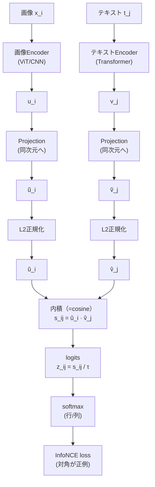

# CLIPの全体像（対照学習）
CLIPはContrastive Language–Image Pretrainingの略。
高速に候補を集める **Embedding（Dual-Tower）** を、**画像×テキスト**で成立させた代表格が CLIP。  
画像とテキストを 同一の表現空間（同じベクトル空間）へ写像し、内積（= cosine類似度）で「一致度」を測る。
<br>
CLIPの計算を体感できるexcelファイル
[CLIP　損失関数計算.xlsx](https://github.com/user-attachments/files/24844530/CLIP.xlsx)

> [!TIP]
> RAGでの位置づけは基本これ：  
> **CLIP = 1st stage retrieval（候補回収）**  
> **Reranker（Cross-encoder）= 2nd stage rerank（精密並べ替え）**

---

## 目次
- [1. CLIPの全体像](#1-clipの全体像)
- [2. Embeddingは何をしているのか](#2-embeddingは何をしているのか)
  - [2.1 全体図（Dual-Tower / Bi-encoder）](#21-全体図dual-tower--bi-encoder)
  - [2.2 実際に用いる埋め込みベクトルはどこから取る？](#22-実際に用いる埋め込みベクトルはどこから取る)
  - [2.3 なぜL2正規化して内積（cosine）なのか](#23-なぜl2正規化して内積cosineなのか)
  - [2.4 転置×行列積が「類似行列」になる理由](#24-転置行列積が類似行列になる理由)
- [3. 学習方法（InfoNCE）](#3-学習方法infonce)
  - [3.1 logitsと温度（temperature）](#31-logitsと温度temperature)
  - [3.2 softmax](#32-softmax)
  - [3.3 InfoNCE損失（対称CLIP損失）](#33-infonce損失対称clip損失)
- [4. 推論（Inference）](#4-推論inference)
  - [4.1 画像とテキストの相互検索](#41-画像とテキストの相互検索)
  - [4.2 ゼロショット分類（zero-shot）](#42-ゼロショット分類zero-shot)
- [5. 使いどころ（実務の利用例）](#5-使いどころ実務の利用例)
- [6. Qwen3-VL-Embedding / Reranker との対応関係](#6-qwen3-vl-embedding--reranker-との対応関係)
---

## 1. CLIPの全体像



> [!NOTE]
> CLIPは **Dual-Tower**なので  
> - 候補側（画像/テキスト）の埋め込みを **事前計算して保存**できる（検索に強い）  
> - ただし **ペアの精密照合（細部の突き合わせ）**は苦手  
> → 厳密さが必要なら **Reranker（Cross-encoder）**で2段にするのが王道。

---

## 2. Embeddingは何をしているのか

### 2.1 全体図（Dual-Tower / Bi-encoder）

Dual-Tower / Bi-encoder は **2本の塔（tower）**で動くモデル。

- 画像（Image）とテキスト（Text）を **別々にモデルへ入力**
- それぞれを **固定長ベクトル**に変換
- 2つのベクトルの近さ（内積 / cosine）で「一致度」を測る

```text
Image ---> Image Encoder ---> u_i ---> Projection ---> û_i（L2正規化）
Text  ---> Text  Encoder ---> v_j ---> Projection ---> v̂_j（L2正規化）

score = û_i · v̂_j   （正規化済みならcosineと同じ）
```

---

### 2.2 実際に用いる埋め込みベクトルはどこから取る？

CLIPは最終的に「画像代表ベクトル」「テキスト代表ベクトル」を取り出し、同次元へ射影して比較する。

#### 画像側（例：ViT）
- 画像をパッチに分割 → トークン列へ
- Transformerで更新
- **[CLS]トークン**（または平均pool）を画像代表として使うことが多い

#### テキスト側（例：Transformer）
- テキストをトークン列へ
- Transformerで更新
- **[EOS]（文末）**や **[CLS]**相当を代表として使うことが多い

#### Projection head（同次元化）
- 画像側・テキスト側それぞれの代表ベクトルを **同じ次元 d** に合わせる（線形変換のことが多い）

#### L2正規化（cosine化）
- ベクトル長を1にして、方向（角度）だけで比較できるようにする

---

### 2.3 なぜL2正規化して内積（cosine）なのか

L2正規化をすると「内積 = cosine」にできるので、**意味の近さ（方向の近さ）**で比較しやすくなる。

- 長さ（スケール）ではなく **方向**で勝負できる（=「意味が近いか」）
- 検索（ANN）で扱いやすい（内積/cosineは定番）
- バッチで一括計算しやすい（行列積に落とせる）


#### L2正規化の後内積計算でcos類似度計算


---

### 2.4 転置×行列積が「類似行列」になる理由

バッチ内に画像N枚・テキストN本があるとき、埋め込みを行列に並べる。

- 画像埋め込み `U`：`N×d`（各行が画像1つ）
- テキスト埋め込み `V`：`N×d`（各行がテキスト1つ）

このとき、全ペアの類似度を一気に計算できる：

```text
S = U × V^T
  = (N×d) × (d×N)
  = (N×N)
```

- `S[i, j]` が「画像 i と テキスト j の内積（= cosine）」なので  
  **全ペアの一致度が並んだ表 = 類似行列（similarity matrix）**。

---

## 3. 学習方法（InfoNCE）

CLIPの学習の狙いはシンプル：

- 正例（対応する画像とテキスト）を **近づける**
- 負例（対応しない組）を **遠ざける**

そのために「正例を当てる多クラス分類」をさせるのが **InfoNCE（対照学習の損失）**。

---

### 3.1 logitsと温度（temperature）

類似度 `s_ij` をそのままsoftmaxに入れると、学習が極端になったり不安定になったりするため、  
温度 `τ`（temperature）で割って **logits**（softmaxの入力）にする。


温度 `τ` の効果（直感）：

- `τ` が **小さい** → softmaxが **尖る** → 少しの差でも勝敗がつく（分離が強いが不安定化しやすい）
- `τ` が **大きい** → softmaxが **なだらか** → 学習は安定するが分離が弱くなりやすい

> [!NOTE]
> 実装では `logit_scale = 1/τ` を学習パラメータにする流儀も多い。

---

### 3.2 softmax

CLIPは基本 **双方向（対称）**で学習する。

#### 画像→テキスト（行方向softmax）
「画像 i を固定したとき、正しいテキストはどれ？」  
→ **行方向**にsoftmax（行の和が1）


#### テキスト→画像（列方向softmax）
「テキスト j を固定したとき、正しい画像はどれ？」  
→ **列方向**にsoftmax（列の和が1）


---

### 3.3 InfoNCE損失（対称CLIP損失）

バッチ内では「画像 i とテキスト i が正例」（= 対角が正例）である。


- 画像→テキスト：対角 `p_ii^(i→t)` を大きくしたい（正しいテキストを当てたい）
- テキスト→画像：対角 `p_jj^(t→i)` を大きくしたい（正しい画像を当てたい）
- 最後に **平均**して対称にする


---

## 4. 推論（Inference）

### 4.1 画像とテキストの相互検索

学習済みの埋め込みがあれば、検索は単純です。

- 画像クエリ（1枚の画像）→ テキスト候補（大量）  
  内積（cosine）が最大のものを上位に並べる

```text
score(text_j) = û_query · v̂_j
Top-K を返す
```

- テキストクエリ → 画像候補も同様

> [!TIP]
> Dual-Towerなので「候補側の埋め込みを事前計算」できて高速です。

---

### 4.2 ゼロショット分類（zero-shot）

「クラス名」をテキストとして埋め込み、画像と最も近いクラスを選びます。

1. ラベルを文章にする（prompt）  
   例：`a photo of a {label}`
2. 各ラベル文をテキストEncoderで埋め込む（v̂_label）
3. 画像の埋め込み（û_img）と内積して最大を取る

```text
pred = argmax_label ( û_img · v̂_label )
```

---

## 5. 使いどころ（実務の利用例）

- [ ] 画像↔テキスト検索（社内画像検索、デザイン資産検索、製品写真検索）
- [ ] 文書画像の粗い分類（テンプレ/レイアウト分類の入口）
- [ ] ゼロショット分類（ラベル追加が軽い）
- [ ] クラスタリング前処理（埋め込み → PCA/UMAP → HDBSCAN 等）
- [ ] RAGのretrieve（画像・スクショ検索の入口）

> [!NOTE]
> CLIP単体は「候補回収」が得意。  
> “厳密にこのページのこの段落が根拠” まで詰めたいなら、Rerankerで2段にするのが自然です。

---

## 6. Qwen3-VL-Embedding / Reranker との対応関係

- **CLIP**：画像×テキストの **Dual-Tower + InfoNCE**（検索の入口に強い）
- **Qwen3-VL-Embedding**：CLIP的な“検索の入口”を、より一般のマルチモーダルへ拡張した系（思想が近い）
- **Reranker（Cross-encoder）**：候補K件だけを精密照合して並べ替える（Embeddingが苦手な部分）

```text
Embedding（CLIP / Qwen3-VL-Embedding）: 速い・広く候補を集める
Reranker（Qwen3-VL-Reranker）: 遅いが精密・ペア照合で順位を詰める
```

---


