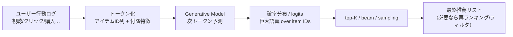
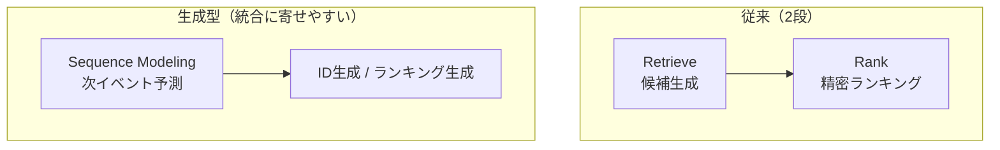

# Generative Recommendation（生成型レコメンド）まとめ  
**（従来手法との差分 / 利用例 / Netflixの変遷）**

参照：Netflix Tech Blog  
- **Towards Generalizable and Efficient Large-Scale Generative Recommenders（2026-01-01）**  
  https://netflixtechblog.medium.com/towards-generalizable-and-efficient-large-scale-generative-recommenders-a7db648aa257

---

## 目次
- [1. Generative Recommendation とは何か](#1-generative-recommendation-とは何か)
- [2. 従来の協調フィルタリング（CF）との違い](#2-従来の協調フィルタリングcfとの違い)
  - [2.1 目的関数（何を当てるか）が違う](#21-目的関数何を当てるかが違う)
  - [2.2 パイプライン（retrieve→rank）を置き換え/統合しやすい](#22-パイプラインretrieverankを置き換え統合しやすい)
  - [2.3 コールドスタート（新規アイテム）への設計が強い方向に寄せられる](#23-コールドスタート新規アイテムへの設計が強い方向に寄せられる)
  - [2.4 計算コストのボトルネックが変わる（巨大語彙問題）](#24-計算コストのボトルネックが変わる巨大語彙問題)
- [3. 利用例（どこで生成型が効きやすいか）](#3-利用例どこで生成型が効きやすいか)
  - [3.1 セッション推薦・短期遷移が強い領域](#31-セッション推薦短期遷移が強い領域)
  - [3.2 検索＋推薦を1モデルに寄せたい領域](#32-検索推薦を1モデルに寄せたい領域)
  - [3.3 フィード型UIでランキング生成をやりたい](#33-フィード型uiでランキング生成をやりたい)
- [4. Netflixのレコメンデーションシステム変遷（ざっくり）](#4-netflixのレコメンデーションシステム変遷ざっくり)
  - [4.1 DVD時代（Cinematch / Netflix Prize）](#41-dvd時代cinematch--netflix-prize)
  - [4.2 ストリーミング移行（体験最適化）](#42-ストリーミング移行体験最適化)
  - [4.3 2010s後半〜（ユースケース増殖と統合の必要）](#43-2010s後半ユースケース増殖と統合の必要)
  - [4.4 2025（Foundation Modelへ）](#44-2025foundation-modelへ)
  - [4.5 2026（大規模 Generative Recommenders）](#45-2026大規模-generative-recommenders)
- [5. まとめ（実務上の使い分け）](#5-まとめ実務上の使い分け)

---

## 1. Generative Recommendation とは何か

**ユーザーの行動列（視聴/クリック/購入など）を「トークン列」として扱い、次に起きる行動（次に消費されるアイテム）を「生成」する推薦**。

- 典型的には **next-event prediction（次イベント予測）**として定式化
- ここでの「生成」は、自然言語の文章生成というよりも次を指すことが多い  
  - **アイテムID（語彙化したID）をトークンとして生成する**
  - **ランキング（順序付きリスト）を生成する**

> [!NOTE]
> Netflix 2026記事は、推薦を「系列予測（次に何が起きるか）」として扱い、  
> 巨大スケールでの学習・推論を成立させるための工夫（効率化、汎化、サービング整合）を中心に論じている。

---

### （イメージ）生成型レコメンドの最低限の流れ

> [!TIP]
> 「生成」と言いつつ、実運用では **top-K候補**を作って、  
> ルール/制約/多様性/ビジネス要件で後処理する設計が入りやすい。

---

## 2. 従来の協調フィルタリング（CF）との違い

### 2.1 目的関数（何を当てるか）が違う

- **CF（典型）**：ユーザー×アイテムの相互作用（共起）から「好みの近さ」を推定し、  
  **スコア（評価/クリック確率など）**を出す → そのスコアでランキング
- **生成型**：行動列そのものをモデル化して、  
  **「次に起こるイベント（次に見る/買う/クリックする）」**を直接当てにいく（=生成）

---

### 2.2 パイプライン（retrieve→rank）を置き換え/統合しやすい

多くの大規模推薦は今でも **候補生成（retrieve）→ランキング（rank）**の2段構え。

生成型は「ID生成」を使って候補生成をやったり、ランキングまで生成に寄せたりして、  
**複数コンポーネントを統合**しやすい（研究面・運用面の狙い）。

> [!NOTE]
> 「統合」は万能ではなく、運用要件（遅延/説明/制約/多様性/安全）に応じて  
> どこまで統合するかは設計問題になる。

---

### 2.3 コールドスタート（新規アイテム）への設計が強い方向に寄せられる

- CFは協調信号が強いと強力だが、**新規アイテムは信号が薄く弱い**ことが多い
- Netflix 2026記事では、**コンテンツ由来の意味表現（semantic）**を使う設計を重視
  - マルチモーダルな **semantic item tower** を導入
  - 学習時に **協調埋め込みをマスク**して、意味情報だけでも推論できるように訓練  
  → 新規/低露出アイテムにも強くしやすい

> [!TIP]
> 実務の言い方に寄せると：  
> **「協調（行動ログ）だけに依存しない fallback 経路を作る」**設計。

---

### 2.4 計算コストのボトルネックが変わる（巨大語彙問題）

生成型は「語彙（=アイテム数）」が巨大になりやすく、**softmax が重い**。

Netflix 2026記事は、たとえば以下で学習・推論を成立させる方針を述べている：

- **sampled softmax**（近似で計算を軽くする）
- **projected / compressed head**（出力層の圧縮）

> [!WARNING]
> 生成型の主戦場が「巨大語彙の計算」と「オンライン推論の遅延」に寄りやすい点は、  
> PoC → 本番で壁になりやすい。

---

## 3. 利用例（どこで生成型が効きやすいか）

### 3.1 セッション推薦・短期遷移が強い領域

- 連続視聴（次に見る1本）
- ECの買い回り（次に買う1点）
- 音楽（次に聴く曲）

→ 「次イベント予測」がそのまま価値になりやすい。

---

### 3.2 検索＋推薦を1モデルに寄せたい領域

- クエリ理解 → 候補生成 → 再ランキング → 説明生成  
をモデル統合しやすい（※実装・運用上の統合メリットが大きい）。

> [!NOTE]
> ここは「研究的に美しい」だけでなく、  
> **運用でモデルが増殖して保守が難しくなる問題**への回答にもなり得る。

---

### 3.3 フィード型UIでランキング生成をやりたい

- 「並びそのもの」を生成で最適化したいケース
- 探索（exploration）や意外性（serendipity）を設計に組み込みたいケース

---

## 4. Netflixのレコメンデーションシステム変遷（ざっくり）

> [!TIP]
> 「何を最適化するか」が時代とプロダクト形態で変わる、という整理が分かりやすい。

### 4.1 DVD時代（Cinematch / Netflix Prize）

- 当時は「ユーザーが作品を何点で評価するか」に寄った問題設定が中心
- Netflix Prize（精度改善コンペ）で協調フィルタリング系が大きく発展

---

### 4.2 ストリーミング移行（体験最適化）

- 視聴ログ（いつ/どの端末/どのくらい）や「表示したが再生されなかった推薦」など、  
  **豊富な行動データ**が使えるようになり、目的が拡張
- ホーム画面（棚の行×列）全体で、  
  - どの棚を出すか
  - 順序をどうするか
  - サムネイルをどう出すか  
  など「ページ構成」レベルの最適化が重要に

---

### 4.3 2010s後半〜（ユースケース増殖と統合の必要）

- 通知、検索、関連、ホーム…などでモデルが増えがち
- Netflixは 2023年に「複数モデルの統合（consolidation）」の学びを記事化し、  
  運用性・開発速度の改善を狙う方向を示した（という流れ）

---

### 4.4 2025（Foundation Modelへ）

- 複数の専門モデルを「1つの強力な基盤モデル」に寄せ、下流アプリへ知識を配る  
  （埋め込み供給・統合・FTなど）
- 典型的には「定期スクラッチ事前学習 + 日次の最新データ微調整 + 埋め込み更新」  
  のような運用が語られている（という整理）

---

### 4.5 2026（大規模 Generative Recommenders）

Netflix 2026記事の主眼（本文の整理）：

- **スケーリング（1M→1Bパラメータ級）**の評価と法則性（MRRなど）
- **巨大語彙に対する効率化**（sampled softmax / compressed head）
- **サービング遅延との整合（alignment）**  
  キャッシュ等で分布がズレる問題に、multi-token prediction などで対処
- **コールドスタート**  
  semantic item tower（マルチモーダル）と学習設計（協調埋め込みマスク）

---

## 5. まとめ（実務上の使い分け）

### 協調フィルタリング（CF）
- 協調信号が強い領域で強い
- 実装が比較的軽く、直感的
- ただし新規アイテムや多面最適化は工夫が必要になりがち

### 現代の2段推薦（retrieve→rank）
- 大規模運用の王道
- ただし面ごとにモデルやロジックが増殖しやすい

### 生成型（foundation / generative）
- 次イベント予測・系列モデル化により統合しやすい
- 意味情報（マルチモーダル）でコールドスタートを補いやすい
- 一方で **巨大語彙の計算**・**サービング整合**が主戦場になりやすい  
  （Netflix 2026記事はまさにその論点を中心に整理）

> [!TIP]
> 実務での最初の判断軸（雑に言うと）  
> - 「次に何が起きるか」が価値の中心 → 生成型がハマりやすい  
> - とにかく堅実にスケールさせたい → 2段推薦が強い  
> - 協調信号が濃く、軽量で十分 → CFが刺さることも多い
