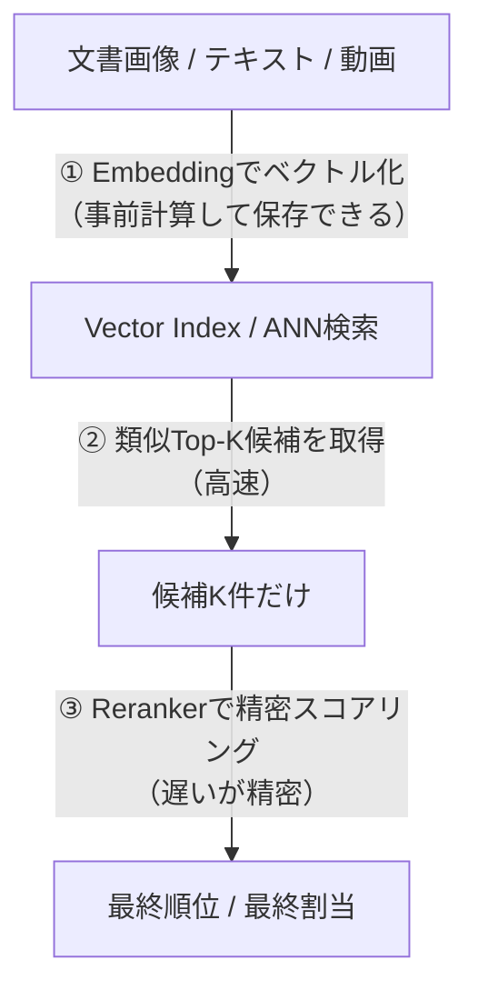

# Qwen3-VL-Embedding と Qwen3-VL-Rerankerの全体像（AI OCR × RAG）

高速に候補を集める **Embedding** と、精密に並べ替える **Reranker** の2段構え。  
テキスト / 画像 / 文書画像 / 動画を **同一の表現空間**で扱う。

> [!TIP]
> RAGでの使い方は基本これ：  
> **Embedding = 1st stage retrieval** / **Reranker = 2nd stage rerank**

---

## 目次
- [1. Qwen3-VL-EmbeddingとRerankerの全体像](#1-qwen3-vl-embeddingとrerankerの全体像)
- [2. Embeddingは何をしているのか](#2-embeddingは何をしているのか)
  - [2.1 全体図（Dual-Tower / Bi-encoder）](#21-全体図dual-tower--bi-encoder)
  - [2.2 実際に用いる埋め込みベクトルはどこから取る？](#22-実際に用いる埋め込みベクトルはどこから取る)
  - [2.3 なぜ最終層の[EOS]で全文・全画像を代表できるのか](#23-なぜ最終層のeosで全文全画像を代表できるのか)
  - [2.4 そもそも「隠れ状態」って何ですか？](#24-そもそも隠れ状態って何ですか)
- [3. Rerankerは何をしているのか](#3-rerankerは何をしているのか)
- [4. 入力フォーマットについて](#4-入力フォーマットについて)
- [5. 学習方法について](#5-学習方法について)
  - [5.1 CLIPとの類似性](#51-clipとの類似性)
  - [5.2 InfoNCEのしていること](#52-infonceのしていること)
- [6. 使用例](#6-使用例)
  - [6.1 公開例](#61-公開例)
  - [6.2 公開例Bの設計](#62-公開例bの設計)
  - [6.3 AI-OCRを業務に適用する際の要件（機能/非機能）・既存との差別化ポイント](#63-ai-ocrを業務に適用する際の要件機能非機能・既存との差別化ポイント)

---

## 1. Qwen3-VL-EmbeddingとRerankerの全体像



---

## 2. Embeddingは何をしているのか

## 2.1 全体図（Dual-Tower / Bi-encoder）

Dual-Tower / Bi-encoder は **2本の塔（tower）**で動くモデル。

- Query（探したいもの）と Document（候補）を **別々にモデルへ入力**
- それぞれを **固定長ベクトル**に変換
- 2つのベクトルの近さ（主に cosine 類似度）で「関連度っぽさ」を測る

```text
Query ----> Encoder (Tower) ----> q_vec（ベクトル）

Doc  -----> Encoder (Tower) ----> d_vec（ベクトル）

score = cosine(q_vec, d_vec)
```

---

## 2.2 実際に用いる埋め込みベクトルはどこから取る？

Embeddingは **ベースモデル最終層の [EOS] トークンの隠れ状態**を最終表現として取り出す。

- 各層：$l = 1..L$
- 各位置：$t = 1..T$

「最終層 $l=L$ の出力（= `last_hidden_state`）」のうち、  
`[EOS]`（文末を表す特殊トークン）が置かれた位置 $t=T$ のベクトルを取る（下図の ⭐︎ の部分）。

### [EOS]の概念図

```text
                  位置 t（トークンの並び）
        t=1     t=2     t=3         ...     t=T-1    t=T(EOS)
l=1   [ ● ]   [ ● ]   [ ● ]        ...     [ ● ]    [ ● ]
l=2   [ ● ]   [ ● ]   [ ● ]        ...     [ ● ]    [ ● ]
l=3   [ ● ]   [ ● ]   [ ● ]        ...     [ ● ]    [ ● ]
 ...    ...     ...     ...                 ...      ...
l=L   [ ● ]   [ ● ]   [ ● ]        ...     [ ● ]    [ ⭐︎ ]
```

---

## 2.3 なぜ最終層の[EOS]で全文・全画像を代表できるのか

Qwen3-VL のバックボーンが **causal attention（自己回帰マスク）**を用いているから。

自己回帰モデルでは、位置 $t$ の表現はそれ以前の全トークンを参照して更新される。  
したがって **最後のトークン（[EOS]）は前にある全てを見ている**。

> [!NOTE]
> 「いつでも必ず最良」という意味ではなく、**この取り出し方が有効になるようにモデルと学習が設計されている**、という理解が安全。

---

## 2.4 そもそも「隠れ状態」って何ですか？

直感的には、各トークンの **理解メモ**。

例：

```text
私は りんご を 食べた
```

モデルは各位置に対して「内部メモ（hidden state）」を作る：

- 「私は」位置：主語っぽい・人間っぽい…など
- 「りんご」位置：食べ物っぽい・目的語っぽい…など
- 「食べた」位置：動詞・過去形・文末…など

実際にはラベルが付くわけではなく、**2048次元や4096次元の数値ベクトル**として表現される。

より具体的に、Qwen3-VL-EmbeddingはTransformerを用いている。  
Transformerは層が積み重なっていて、層ごとに「各トークンの表現」を更新する。

```text
0層（埋め込み直後）：単語そのもの＋位置情報のベクトル
1層：周囲（前文脈）の情報を混ぜた表現
…
最終層：タスクに使いやすい、より抽象的な表現
```

この **各層 × 各位置**で出るベクトルが hidden state。  
「隠れ状態」はRNN由来の呼び方で、外に直接見せる出力ではない内部状態という意味で “hidden” と呼ぶ。

---

## 3. Rerankerは何をしているのか

Rerankerは **Single-Tower / Cross-encoder** で動く。

Query と Doc を **一緒にモデルへ入力**し、cross-attentionで  
「Queryの各要素」と「Docの各要素」を突き合わせて **このペアは関連する？** を精密に判定する。

```text
[Instruction][Query][Doc] ---> Single Encoder (Cross-Attention) ---> score
```

Rerankerでは関連度スコアを **特別トークン yes/no の生成確率**で表現している。

### attentionの直感（図の説明）


- **Q（Query）**：どこを見たいか
- **K（Key）**：各トークンの「見出し」
- **V（Value）**：各トークンの「中身」

「Query側のトークンが、Doc側のトークンを見に行く」のが cross-attention のコア。

---

## 4. 入力フォーマットについて

Embedding側は instruction を system message として渡し、デフォルトは **“Represent the user’s input.”**。

まとめると以下：

```text
Embedding:
[Instruction][Query/Doc][PAD]  --->  last hidden states  ---> embedding

Reranker:
[Instruction][Query][Doc][ASSISTANT] ---> LM head ---> P("yes") 等 ---> score
```

---

## 5. 学習方法について

## 5.1 CLIPとの類似性

CLIPと似たシステムを採用している。損失関数は **InfoNCE（コントラスト学習）**を用いている。

- **CLIP**：画像エンコーダ＋テキストエンコーダのモデルと学習枠組み
- **InfoNCE**：対照学習で使う損失関数（一般形）

CLIPとInfoNCEの違いは2つ。

### 違い1：対象
- InfoNCEは何にでも使える一般の損失
- CLIPは「画像とテキストのbi towerモデル」＋「その損失で学習する」という具体的なシステム

### 違い2：CLIPは双方向（対称）
InfoNCEは片方向でも定義できるが、CLIPは基本 **画像→テキスト** と **テキスト→画像** の両方を足す構成。

> [!NOTE]
> 原文の「InfoNSE」は一般的には **InfoNCE** の表記がよく使われる。

---

## 5.2 InfoNCEのしていること

InfoNCE（Information Noise-Contrastive Estimation）は、1つのクエリ $q$ に対して

- 正例：$d^{+}$
- 負例：$d^{-}$（複数）

の中から **「正例を当てる多クラス分類」**をさせて損失関数を出す。

典型形：


「正例を負例集合の中で当てる」softmax分類をして、  
その **負の対数尤度（クロスエントロピー）**を損失としている。

### 記号の意味

- $q$：クエリ（query）  
  例：検索なら「質問文」。CLIPなら「画像 or テキスト」の片方。  
  embedding文脈だと「埋め込みベクトルの元となる入力」を指すことが多い。

- $s(q,d)$：類似度スコア（similarity）  
  $q$ と $d$ の近さを数値化したもの。大きいほど似ている。  
  今回はコサイン類似度を用いる。


L2正規化している場合、コサイン類似度は $[-1,1]$ に収まる。

- $\tau$：温度  
  - $\tau$ が小さい → softmaxが尖る → 少しの差でも強く勝敗がつく（分離が強いが不安定にもなりやすい）
  - $\tau$ が大きい → softmaxがなだらか → 学習は安定するが分離が弱くなりやすい

---

## 6. 使用例

## 6.1 公開例

1. 公式：マルチモーダルRAGのE2E例（PDF→画像化→埋め込み→検索）  
   - [公開例A](https://github.com/QwenLM/Qwen3-VL-Embedding/blob/main/examples/Qwen3VL_Multimodal_RAG.ipynb)
2. Holisticon社：OSSのマルチモーダル検索demo  
   - [公開例B](https://github.com/holisticon/multimodal-rag-demo)
3. Qwen3-VL-Embeddingを用いたローカル画像検索アプリ  
   - [公開例C](https://zenn.dev/robustonian/articles/qwen3-vl-embedding_search)

---

## 6.2 公開例Bの設計

- ingest → index → query → answer の順で処理が進む

### アーキテクチャ（実装構造）

#### Ingest
- PDFは「ページ画像」+「抽出テキスト」の両方を取り込むので、画像でもテキストでも検索可能
- テキストはチャンク化（デフォルト：`chunk=1200 / overlap=200`）
- PDFレンダリングのDPIもパラメータ化（デフォルト：`pdf-dpi=75`）

#### Index
- 画像（ページ）・テキスト（チャンク）の両方を埋め込み、UI上で「ページ画像」と「テキスト断片」をソースとして出している

#### Query
- テキスト / 画像 / 両方で検索できる
- `top_k / rerank_k` の概念があり、rerankerのON/OFFも切替可能

#### Answer
- ローカル生成（transformers） or OpenAI互換API（LM Studio等） or リモートOpenAI などを切り替え可能

---

## 6.3 AI-OCRを業務に適用する際の要件（機能/非機能）・既存との差別化ポイント

### 機能要件
- [ ] PDF取り込み（ページ分割）
- [ ] 画像クエリ（スクショから検索）
- [ ] テキストクエリ検索
- [ ] 結果のページ提示
- [ ] 削除（忘れさせる / 再インデックス）
- [ ] 自動要約
- [ ] FAQ生成
- [ ] 監査ログ
- [ ] reranker切替

### 非機能要件
- [ ] レイテンシ：P95（例：検索3秒以内、生成10秒以内）
- [ ] コスト：VRAM制約（2B/8Bどちらを使うか、量子化前提か）
- [ ] セキュリティ：ローカル完結 or クラウド、保存期間、PII取り扱い

### 差別化ポイント
- [ ] 壊れたOCRでも推論して探せる（ノイズ耐性）
- [ ]スクショで探せる（画像クエリ）
- [ ] テンプレが違っても同類を当てられる（レイアウト検索）
- [ ]根拠画像まで提示できる（監査・説明）
- [ ]新規帳票の立ち上げが速い（Agenticにテンプレ自動発見→運用）

